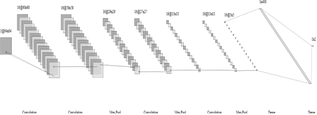
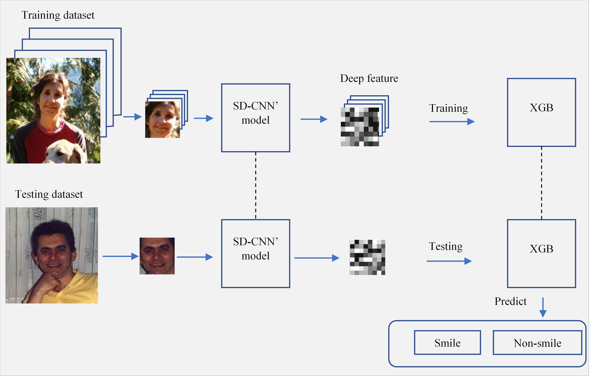
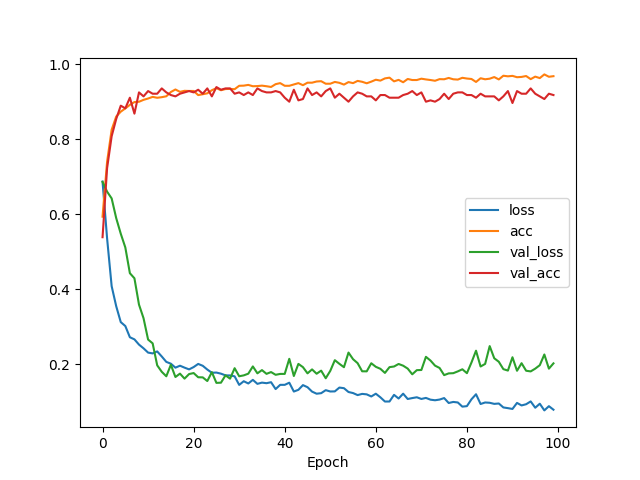

# Smile detection in class imbalance scenarios

This source code contains the implemetation of hybriid framework for smile detection in class imbalance scenarios, which is described in our paper **A hybrid framework for smile detection in class imbalance scenarios** (in submitting).

- Smile CNN model 


- Hybrid smile framework 



## Library dependencies
- Python 2.7
- TensorFlow (>= 1.5)
- Keras (>= 2.2)
- NumPy (>= 1.14)
- Sklearn (>= 0.19)
- Pandas (>= 0.21)
- XGB (>= 0.6)
- Matplotlib (>= 2.1)
- Dlib (19.13)

## Data requirement 
The demo code uses GENKI-4K dataset, which could be downloaded from [**this link**](http://mplab.ucsd.edu/wordpress/?page_id=398)

## Usage
Please look at *smile_detection.py* and reference to paper to more details in implementation.

```bash
$ Usage: python smile_detection.py <args>
```
where args are the following
- `--train` is train command. 
- `--test` is test command. 
- `--generate` is face image generation.

Again, please look at source code for more details. 

## Results

- A cross validation on experimental dataset is peromed in which data is randomly split in four folds, which has 1000 images in each fold. The Smile CNN is trained in 3 folds and test in the remaining fold with **Adam optimization** in 100 epochs, batch size is 50 images. 



- Performance compared with other methods on GENKI4K dataset 

| Model            | Feature                      | Classifer  | Accuracy (%)  | 
| :---:            | :---:                        |    :---:   | :---:         |
| [1]              |  HOG                         | ELM        | 88.2          | 
| [2]              |  Pixel comparison            | AdaBoost   | 89.7          | 
| [3]              |  HOG (labeled + unlabeled)   | SVM        | 88.2          | 
| [4]              |  Raw pixels                  | Softmax    | 56.91         | 
| [4]              |  Learned features            | SVM        | 92.4          | 
| [4]              |  Learned features            | AdaBoost   | 91.8          | 
| **Smile-CNN**    |  **Raw pixels**              | **Softmax**| **92.7**      | 
| **Hybrid-Smile** |  **Learned features**        | **XGB**    | **93.6**      | 

## References 
[1] An L., Yang S., Bhanu B: Efficient smile detection by Extreme Learning Machine. Neurocomputing, Vol. 149, pp. 354-363, 2015.

[2] Shan C.: Smile detection by boosting pixel differences. IEEE transactions on image processing, 21(1), 431-436, 2012.

[3] Liu M, Li S., Shan S., Chen X.: Enhancing Expression Recognition in the Wild with Unlabeled Reference Data. Asian Conference on Computer Vision (ACCV) 2012, pp. 577-588, 2012

[4] Chen J., Ou Q., Chi Z., Fu H.: Smile detection in the wild with deep convolutional neural networks. Machine Vision and Applications, 28(1-2), 173-183, 2017.

### License 
See [**LICENSE here**](LICENSE).


